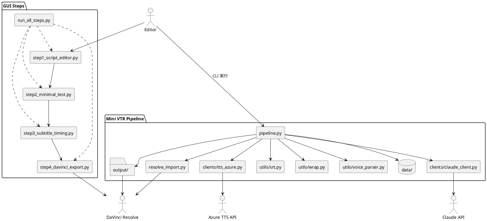

# DaVinci Auto - プロジェクト総合インデックス

## 📋 プロジェクト概要

**Mini VTR Automation Pipeline** - 8分間教育動画自動生成システム

テキストスクリプトからDaVinci Resolve用素材まで一貫制作する日本語対応動画制作パイプライン。Azure TTS、自動字幕生成、プロフェッショナル制作ワークフローを統合。

---

## 🧭 PlantUML サマリービュー



---

## 🗂️ ディレクトリ構造

### 📁 コア制作パイプライン (`/minivt_pipeline/`)
```
minivt_pipeline/
├── 🎯 src/
│   ├── pipeline.py              # メインパイプライン実行
│   ├── resolve_import.py        # DaVinci Resolve連携スクリプト
│   ├── clients/                 # 外部サービス連携
│   │   ├── tts_azure.py        # Azure TTS クライアント
│   │   ├── claude_client.py     # Claude AI連携
│   │   └── llm_subtitle_splitter.py # AI字幕分割
│   ├── utils/                   # ユーティリティモジュール
│   │   ├── srt.py              # SRT字幕生成エンジン
│   │   ├── wrap.py             # 日本語テキスト改行処理
│   │   ├── voice_parser.py     # 音声認識・解析
│   │   └── cost_tracker.py     # コスト・使用量追跡
│   └── config/
│       └── voice_presets.py    # 音声プリセット管理
├── 📂 data/                     # スクリプトファイル・テストデータ
├── 📤 output/                   # 生成結果
│   ├── audio/                  # TTS生成音声
│   └── subtitles/             # SRT字幕ファイル
└── 📋 requirements.txt
```

### 📁 GUI インターフェース (`/gui_steps/`)
```
gui_steps/
├── 🖥️ step1_script_editor.py    # スクリプト編集画面
├── ⚡ step2_minimal_test.py     # 最小限テスト実行
├── 📺 step3_subtitle_timing.py  # 字幕タイミング調整
├── 🎬 step4_davinci_export.py   # DaVinci Resolve出力
├── 🚀 run_all_steps.py          # 統合GUI実行
└── common/
    ├── gui_base.py             # GUI基底クラス
    └── data_models.py          # データモデル定義
```

### 📁 ドキュメント (`/docs/`)
```
docs/
├── 📖 USER_GUIDE.md            # 完全ユーザーガイド
├── 🔧 API.md                   # API仕様・関数リファレンス
└── README.md                   # ドキュメント概要
```

### 📁 プロジェクト管理 (`/projects/`)
```
projects/
└── autocut/
    └── autocut_progress.md     # 自動カット機能開発進捗
    
### 📁 実験・持ち込み素材 (`/experiments/`)
```
experiments/
├── inbox/                # 外部から持ち込むファイル置き場
│   ├── davinci/          # DaVinci 由来（XML, DRP など）
│   └── llm/              # LLM 由来（json, md, txt）
└── scratch/              # 試行コードや一時出力
```
```

---

## 🎯 主要コンポーネント

### 🎵 音声生成システム
- **TTS Engine**: Azure Speech Service統合
- **Voice Switching**: NA（ナレーション）/セリフ（対話）自動切り替え
- **Quality Control**: レート制限・エラーハンドリング
- **Cost Management**: 使用量追跡・最適化

### 📺 字幕生成システム
- **Japanese Text Processing**: 日本語2行改行・句読点ベース
- **Time Synchronization**: 音声長に基づく自動タイムコード生成
- **Format Support**: DaVinci Resolve標準SRT出力
- **AI Integration**: LLM支援字幕分割（オプション）

### 🎬 DaVinci Resolve 統合
- **Script Integration**: Fusion Scripts Menu統合
- **Import Automation**: タイムライン自動インポート
- **Media Pool Management**: プロジェクト素材管理
- **Workflow Optimization**: プロフェッショナル制作対応

### 🖥️ GUI ワークフロー
- **4-Step Process**: スクリプト編集→テスト→調整→出力
- **Real-time Preview**: 音声・字幕プレビュー機能
- **Batch Processing**: 複数スクリプト一括処理
- **Error Handling**: ユーザーフレンドリーエラー表示

---

## 🔧 技術仕様

### 📋 必須要件
- **Python**: 3.11以上
- **DaVinci Resolve**: 18以上（Scripts API有効）
- **Azure Speech Service**: APIキー・リージョン設定
- **OS**: Windows・macOS・Linux対応

### 🔌 主要依存関係
```
pydub              # 音声処理
requests           # HTTP通信
python-dotenv      # 環境変数管理
tkinter            # GUI（標準ライブラリ）
anthropic          # Claude AI連携
```

### ⚡ パフォーマンス特性
- **TTS生成**: 2-3秒/行（シーケンシャル処理）
- **字幕生成**: 0.1秒（即座）
- **DaVinci連携**: 1-2秒（自動インポート）
- **最適化可能性**: 70%高速化（並列TTS処理）

---

## 🚀 使用方法

### 💨 クイックスタート
```bash
# 1. セットアップ
cd minivt_pipeline
pip install -r requirements.txt

# 2. 環境設定 (.envファイル)
AZURE_SPEECH_KEY=your_api_key
AZURE_SPEECH_REGION=your_region
AZURE_SPEECH_VOICE_NARRATION=narration_voice
AZURE_SPEECH_VOICE_DIALOGUE=dialogue_voice

# 3. パイプライン実行
python src/pipeline.py --script data/your_script.txt

# 4. GUI実行
python gui_steps/run_all_steps.py
```

### 📝 スクリプト形式
```
NA: ナレーション内容をここに記述
セリフ: キャラクター対話をここに記述
NA: 次のナレーション
セリフ: 次の対話
```

### 🔧 高度な使用方法
```bash
# テスト実行（音声生成なし）
python src/pipeline.py --script data/script.txt --fake-tts

# 再生速度調整
python src/pipeline.py --script data/script.txt --rate 1.2

# デバッグモード
python debug_split.py
```

---

## 📚 ドキュメント

### 🗒️ ユーザー向け
- **[README.md](README.md)** - プロジェクト概要・クイックスタート
- **[docs/USER_GUIDE.md](docs/USER_GUIDE.md)** - 完全な使用方法・トラブルシューティング
- **[gui_steps/README.md](gui_steps/README.md)** - GUI使用方法
- **[progress.md](progress.md)** - 現行作業の進捗メモ
 - **[docs/EDITOR_ONE_PAGER.md](docs/EDITOR_ONE_PAGER.md)** - 編集者向け1枚もの（どこを自動化しているか）

### 🔧 開発者向け
- **[docs/API.md](docs/API.md)** - API仕様・関数リファレンス
- **[CLAUDE.md](CLAUDE.md)** - Claude Code開発ガイド
- **[projects/autocut/autocut_progress.md](projects/autocut/autocut_progress.md)** - 開発進捗
 - **[docs/NAMING.md](docs/NAMING.md)** - Resolve連携のフォルダ命名
 - **[docs/MAPPING.md](docs/MAPPING.md)** - RowData ↔ LineItem 変換方針

### 🚨 トラブルシューティング
- **よくある問題**: Azure TTS制限・DaVinci接続・文字エンコーディング
- **解決方法**: 詳細は各ドキュメントの該当セクションを参照

---

## 🛣️ 開発ロードマップ

### ✅ 完了済み機能
- [x] 基本TTS・字幕生成パイプライン
- [x] DaVinci Resolve統合
- [x] 日本語2行字幕対応
- [x] GUI ワークフロー（4ステップ）
- [x] 音声プリセット管理
- [x] コスト追跡システム

---

## 🔊 OrionEp2 ランブック（音声ワークフロー要約）

プロジェクト固有スクリプトを使った Resolve 直結フロー。以下は OrionEp2 の例です。

- ナレーション生成（v3 / MP3, 30fps）
  - `python scripts/generate_orionep2_lines_1_27.py`
  - `python scripts/generate_orionep2_lines_28_63.py`

- タイムラインCSV生成（間ルール適用）
  - `python scripts/build_timeline_orionep2.py`
  - out: `projects/OrionEp2/exports/timelines/OrionEp2_timeline_v1.csv`

- FCPXML（ナレーションのみ）
  - `python scripts/csv_to_fcpx7_from_timeline.py projects/OrionEp2/exports/timelines/OrionEp2_timeline_v1.csv`
  - out: `projects/OrionEp2/exports/timelines/OrionEp2_timeline_v1.xml`

- BGM/SE セクション設計と生成
  - 設計: `projects/OrionEp2/inputs/bgm_se_plan.json`
  - 生成: `python scripts/generate_bgm_se_from_plan.py projects/OrionEp2/inputs/bgm_se_plan.json`
  - 再実行（SFXのみ）: `--only sfx`

- BGM 自動整音（-15 LUFS / -1 dBTP / LRA 11, Fade 1.0/1.5s）
  - `python scripts/master_bgm_from_plan.py projects/OrionEp2/inputs/bgm_se_plan.json`
  - out: `projects/OrionEp2/サウンド類/BGM_mastered/*.wav`

- 統合FCPXML（A1=VO, A2=BGM, A3=SE）
  - `python scripts/build_fcpx_with_bgm_se.py \
     projects/OrionEp2/exports/timelines/OrionEp2_timeline_v1.csv \
     projects/OrionEp2/inputs/bgm_se_plan.json \
     projects/OrionEp2/exports/timelines/OrionEp2_timeline_with_bgm_se_mastered.xml`

- Resolve ダッキング（テンプレート方式）
  - テンプレDRP: A1=VO, A2=MUSIC, A3=SE。MUSIC にコンプ、SC入力=VO。
  - 目安: Ratio 4:1 / Attack 120ms / Release 250ms / GR ≈ -7dB。


### 🔄 進行中
- [ ] 自動カット機能 (autocut)
- [ ] 並列TTS処理（70%高速化）
- [ ] Claude AI字幕分割最適化

### 📋 今後の計画
- [ ] 動画素材自動検索・配置
- [ ] エフェクト・トランジション自動適用
- [ ] バッチ処理UI改善
- [ ] Web UI版開発

---

## 🤝 開発・貢献

### 🔧 開発環境セットアップ
```bash
git clone https://github.com/yourusername/davinciauto.git
cd davinciauto
pip install -r minivt_pipeline/requirements.txt
```

### 🧪 テスト実行
```bash
# 最小限テスト
python src/pipeline.py --script data/short_test.txt --fake-tts

# GUI テスト
python gui_steps/step2_minimal_test.py
```

### 📝 コントリビューション手順
1. フォーク作成
2. フィーチャーブランチ作成
3. 変更実装・テスト
4. プルリクエスト作成

---

## 📊 プロジェクト統計

- **総ファイル数**: 100+
- **Python モジュール**: 20+
- **ドキュメント**: 6+
- **テストスクリプト**: 8+
- **GUI コンポーネント**: 5
- **言語**: Python, Markdown
- **ライセンス**: MIT

---

**📞 問い合わせ・サポート**
- Issues: GitHub Issues
- Documentation: `/docs/` フォルダ
- Quick Help: `python src/pipeline.py --help`

**📈 最終更新**: 2025年月 | **バージョン**: 1.0.0
